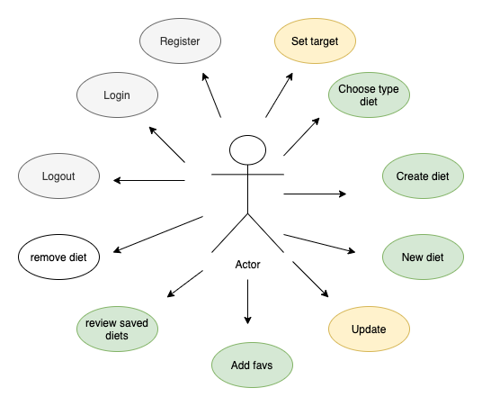
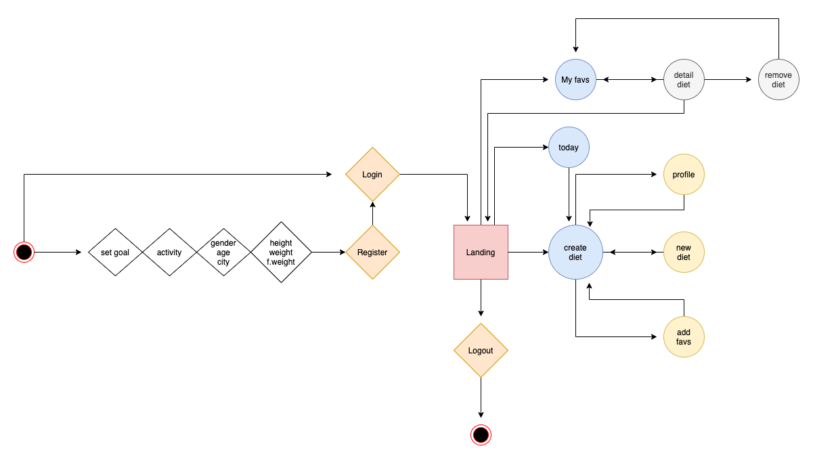
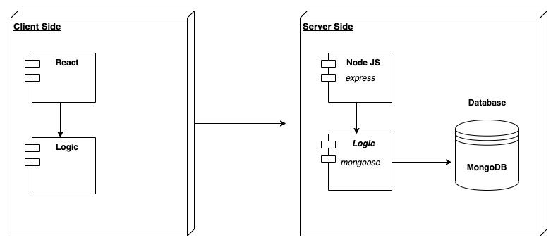
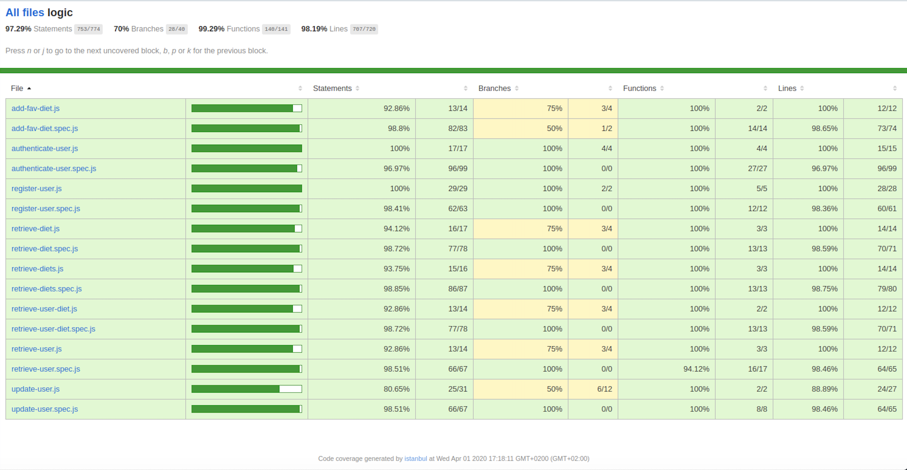
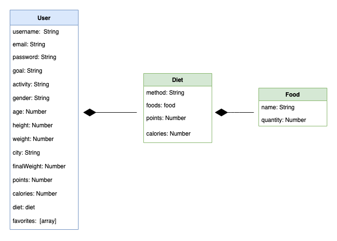

# DIET-YOURSELF

## DESCRIPTION:
Diet-yourself is an app which it looking for the way to facilitate your guidance and organize you a daily diet according your goals.

### Use Cases

### Work Flow

## Technical Description

### Blocks

## Code Coverage

### Server Side

### Data Model

## Technologies

JavaScript, ReactJS, Node.js, Express, MongoDB, Mongoose, SASS & BEM. Testing: Jest & Mocha/Chai

## TO DO

Improve inputs

- Calculate macronutrients between foods
- Add calculation of recommended water
- Choosing diet foods
- Structure numbers of meals a day
- Include more types of diet: vegetarian, vegan, hybrid ...
- Supplementation required